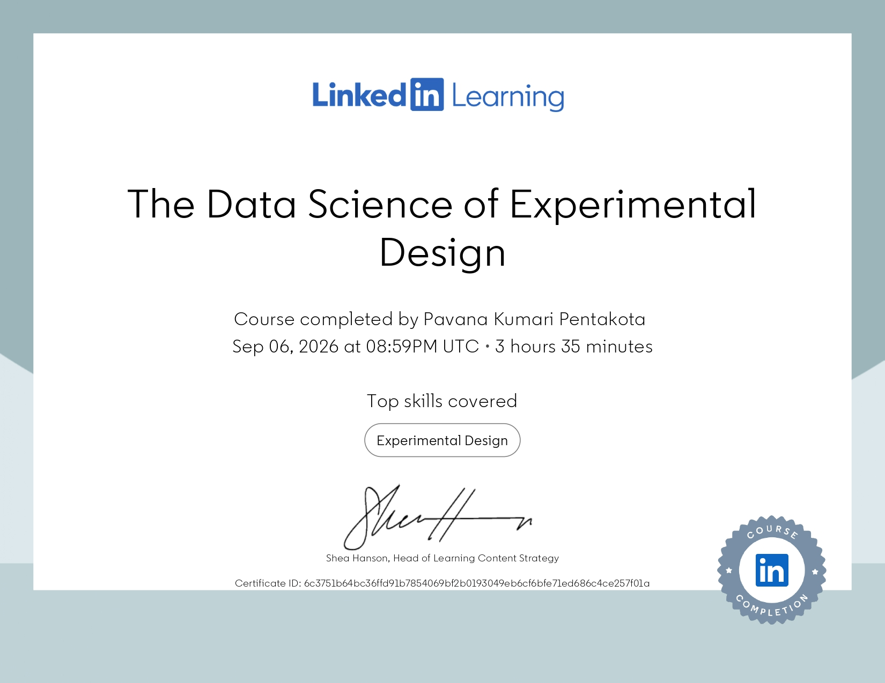

## Junior Data Analyst
I enjoy transforming raw data into meaningful business insights using Excel, SQL, Python, and Power BI.

### Skills

- Excel
- SQL
- Power BI
- Python
- Data Cleaning
- Data Visualization
- Business Analytics

### Currently Learning

- Advanced SQL
- Python for Data Analysis
- Tableu
- German (A1)

### Portfolio Projects

- ENIAC - MAGIST Tableu Project 

### Connect with Me

LinkedIn:
https://www.linkedin.com/in/pavanapentakota/ 

Email:
pentakotapavanakumari@gmail.com

## Visualisations
- 

